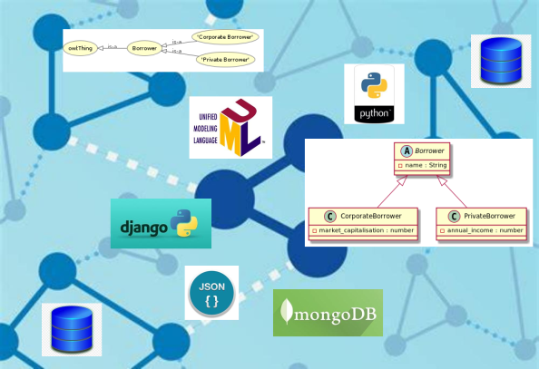

# Academy-Course-DAT31063
Resources for Open Risk Academy Course DAT31063

#### Course Content:

Object-oriented programming and techniques (OOP) such as using classes and inheritance are common in many application programming environments but alas don't "travel well" outside computer memory. When considering data science tasks and objectives the transition from object hierarchies the live inside memory while an application is running, to data structures that can be exchanged (and vice versa) is not always straightforward. 

In this [short course](https://www.openriskacademy.com/mod/book/view.php?id=720) we explore how some popular programming languages, data formats, database API's and web frameworks handle hierarchical classes. The main aspect of OOP we are interested in is _class inheritance_, that is general, using higher level, more general classes, along with more specific, lower level classe. The topics we will cover are as follows:

1. OOP Concepts in Data Science (A brief introduction with focus on properties, not methods)
2. UML Class Diagrams (How to represent object hierarchies graphically)
3. Objects in Python (The easies way to OOP!)
4. JSON and JSON Schema  (Serializing objects to file)
5. Other languages  (A brief discussion of other relevant OOP platforms for data science)
6. Database Table Inheritance (Patterns for storing hierarchical data in relational databases) 
7. PostgreSQL INHERITS (The native functionality of Postgres supporting inheritance)
8. Django Abstract Classes  (Object hierarchies in Django's ORM)
9. Inheritance in MongoDB  (Linked Objects in Document Stores)
10. OWL Classes and Subclasses (Inheritance in OWL Ontologies)
11. Mixing Python and OWL (From OWL to Python and Back)
12. Review / Summary

#### Who Is This Course For:

The course is useful to:
- Data Scientists / Data Engineers
- Quantitative Analysts / Risk Managers 

#### How Does The Course Help:

Mastering the course content provides background knowledge towards the following activities:

- Understanding how class inheritance is handled in the lifecycle of complex data across different tools and platforms
- Implementing practical approaches for preserving relational information when exchanging data

#### What Will You Get From The Course:

- You will be able to confidently discuss the topic of hierarchical data structures in different data science contexts
- You will be able to contribute to the specific use cases mentioned above

#### Course Level and Difficulty Level:

This course is part of the Data Science family.

- This is a *Core Level* course in **Data Science**, which means that good grounding at Introductory level to various data science topics is a prerequisite for making the most out of this course.
- This is a *Technical* course which means various *technology* elements (programming languages, data formats, databases) are needed as background for mastering the material.

If you have not taken an Open Risk Academy course before, the _CrashCourse Academy Demo_ provides a quick overview of the Academy.

#### Course Material:

The course material comprises the following:

- [Twelve online readings](https://www.openriskacademy.com/mod/book/view.php?id=720) (+ a summary review)
- Embedded _exercises_ dispersed in each section
- An [online repository](https://github.com/open-risk/Academy-Course-DAT31063) with scripts and data files

#### Time Requirements and Important Dates

- The course is self-paced and can be undertaken at any point. Depending on your background knowledge and familiarity with the tools used it might require a commitment of about one or two days total.

#### Where To Get Help:

If you get stuck on any issue with the course or the Academy:

- If the issue is related to the course topics / material, check in the first instance the Course Forum (Chat)
- If the issue is related the operation of the Open Risk Academy check first the Academy FAQ. 
- If the issue persists contact us at info at openrisk.eu

## Academy Course Catalog

* [Course List and Description](https://www.openriskmanagement.com/academy-courses/)
